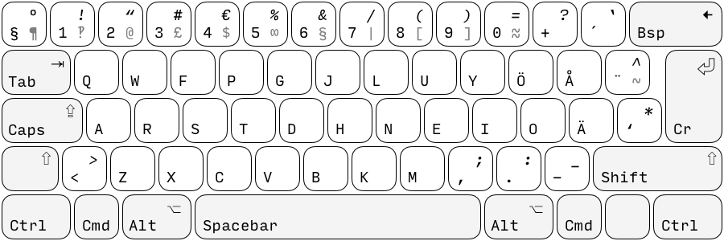

# colemak-se
_The Colemak keyboard layout adapted for the Swedish language._

---

The Colemak layout was originally created by Shai Coleman in 2006 as an ergonomic and modern keyboard layout, bringing together the comfort of Dvorak while retaining a lot of QWERTY familiarity. It employs a home row centric design placing frequently used keys under the strongest fingers. While the original layout is optimised for the English language, its Germanic roots also make it suitable for use when writing Swedish.

## Scope
* Colemak-SE aims to bring a Swedish language adaption of Colemak to all modern operating systems. 
* The base layout targets 102-key keyboards, as these are the far most widely used in Sweden. 
* Colemak-SE makes as few key changes as possible in order to ease the often brutal learning process.

Currently, only macOS and Windows keyboard layouts are available. Linux support and QMK files are under development. Any pull requests with new implementations are greatly appreciated!

# Layout


#### ÅÄÖ-placement
Colemak-SE does not provide full `ÅÄÖ` parity with QWERTY. The `Ö-key` has been moved up a row to where the `P-key` is on QWERTY, to make room for the default Colemak placement of the `O-key`.

# Installation

## Linux
The Linux implementation of Colemak-SE aims to mirror the [English Colemak website](https://colemak.com/Unix). There are a few diffient ways to do it, all with thier neuances.

### xmodmap
[`xmodmap`] is a utility for modifying keymaps in [`Xorg`]. It modifies the layout temporarily and does not require root access.

1. Download the [`xmodmap release`].
2. Open a terminal window and navigate to the file.
3. Run the command:
```bash
$ setxkbmap se && xmodmap xmodmap.colemak-se && xset -r 66
```

If you want to restore QWERTY, run the following:
```bash
$ setxkbmap se && xset -r 66
```

## macOS
To install the layout, simply put the `colemak-se.bundle` in the folder `/Library/Keyboard Layouts`. This will install the layout on a system level, which is usually what you want. If you prefer to have the layout on a user level, place it in the user library instead `~/Library/Keyboard Layouts`.

To install via the terminal:
```bash
$ curl https://github.com/motform/colemak-se/releases/download/1.0/colemak-se.bundle.zip -o colemak-se.bundle.zip
$ unzip colemak-se.bundle.zip && rm colemak-se.bundle.zip
$ mv colemak-se.bundle /Library/Keyboard\ Layouts
```

If you feel uncomfortable using the terminal, a [`.dmg`](https://github.com/motform/colemak-se/releases/download/1.0/colemak-se.dmg) disk image is provided for easy GUI based installation. Just mount the disk image and follow the instructions on screen. 

A system restart is required for the layout to show up in the 'Input Sources' panel, which is accessable though: `System Preferences/Keyboard/Input Sources`. To add a new layout, press the `+`. This takes you to a list of input sources, if your installation went well, Colemak-SE should show up as a layoutoption in the `Swedish` submenu add the layout, and start using Colemak-SE!

## Windows
Download the [compressed folder](https://github.com/motform/colemak-se/releases/download/1.0/windows-colemak-se.zip) and run setup.exe.

# Learning Colemak
For resources on how to learn Colemak, see the [official Colemak website](https://colemak.com/Learn#Tips_for_learning). 

In the [extras](./extras/reference-sheet-A4_colemak-se.pdf) folder, you can find print out pdf:s for easy reference.

# Issues
* The macOS implementation sometimes has strange behaviour when using ctrl-modifier.
* The macOS implementation only has .incs for 'dark mode'.

# Attributions
* macOS keyboard layout created using [Ukelele.](https://scripts.sil.org/cms/scripts/page.php?site_id=nrsi&id=Ukelele) 
* Original Colemak-SE developed in collaboration with [Jakobaa](https://github.com/jakobaa).
* All illustrations are set in [Input](http://input.fontbureau.com) by [DJR](https://djr.com). Free for private use and amazing for code!

# Licence
Original Colemak layout license is provided as is. For more information, se the [Colemak Website](https://colemak.com/License). All the files in this repo are licensed under GPL-3.0, see [LICENSE.](./LICENSE)
